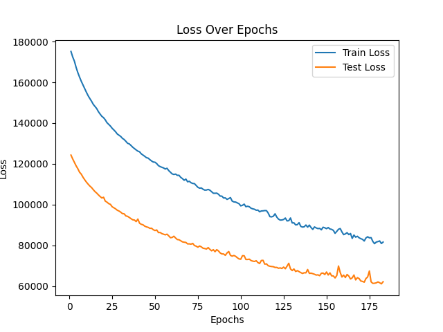
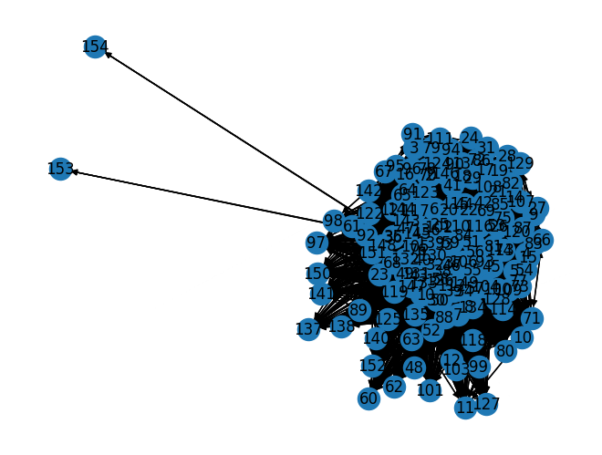

# Honors-Thesis-Extension--Predicting-Trade-from-Treaties
Predicting Trade Densities from Defense Cooperation Agreements, which are a specific type of military agreeement. 

The datasets used come from the Correlates of War Project (https://correlatesofwar.org/data-sets/). 

The specific datasets used from this project include: 
- Defense Cooperation Agreements (https://correlatesofwar.org/data-sets/defense-cooperation-agreement-dataset/)
- Trade (https://correlatesofwar.org/data-sets/bilateral-trade/) in Version 4

The decoding country codes are from: https://correlatesofwar.org/data-sets/cow-country-codes-2/ 

# Random Forests 
The dataset used is the dyadic DCA dataset and dyadic trade dataset. These 2 different datasets are cleaned and merged before applying the random forest model. 
Note that label encoding is used for the country codes, as opposed to one-hot encoding. This prevents creating a sparse dataset which hurts random forest models, but the non-normalized labels don't usually negatively affect random forest models; therefore, I settled on using label encoding. 

This model was given 2 values to predict, the trade flow from country A to country B and the trade flow from country B to country A. 

This model's highest score was 95.07%. 
This score was achieved by cleaning the data with a particular focus on what a Random Forest regressor needs to perform well. For example, I used dimentionality reduction to keep a small number of essential features. I also made sure not to overprocess the dataset with scaling since this would trade essential information in the data for normalization when I know the regressor itself is robust against sensitivity to non-scaled data. 

# LSTM
I use a time series LSTM model on datasets which are stacked for 5 and 10 years. Since the original dataset was in dyad per year format, I had to construct my own time-stacked dataset from the original data. 

This time series LSTM model is best used when there aren't a lot of features. In this case, it seemed that my dataset used for the Random Forests model will also perform well here due to agressive dimentionality reduction. I processed the data to stack at 5 and 10 year time segments. I found through early model testing that the 10 year time segment dataset performed much worse than the 5 year stack dataset. To understand why there was such a significant difference between the dataset performance, I hand-coded test instances to target the model's vulnerabilities. Through this, I found that the 10 year dataset was causing the model overestimate trade levels for non-trading dyads. From my testing, it seems that the stochasticity of the 5 year dataset actually helped LSTM performance. 

My other time-series projects had performed better when a wider time-interval was given, so this difference in model performance was not what I had expected. My other experiences lead me to think that this behavior is somewhat unique to this dataset. I believe that if there were other features which captures closeness of the country dyads, such as rate of military cooperation, other alliances, and geospatial information, then the 10 year time-interval dataset would perform better than the 5 year dataset. 

I continued developing the model with the 5 year dataset. I first adjusted the batch size, testing from 32 to 512. I found that 256 instances in a batch performed well by balancing training time with significant information gain. I then tested the number of layers which should be used. I had expected that fewer layers would perform better as there were only a few features in the dataset after dimensionality reduction, and this expectation was correct. The model performed best with 1 layer. I then went on to adjust the hidden dimension size and found that a higher hidden size is better. This behavior is to be expected for the dataset since the data is highly interconnected due to many dyads between a relatively small number of countries.

Through all of this model tuning, I found that a dataset which has a small number of features but high interconnectedness between the instances does best with few layers and many hidden dimension nodes. 

I implemented the tuned model with early stopping to prevent overtraining. 
 

# GNN 
After the LSTM, I wanted to better-capture the interconnected nature of the dataset in a model. I felt that rather than using a high hidden dimension count in an LSTM, a graph-based approach might perform just as well or even better. 

In order to do this, I had to make my own graph data by extracting nodes, edge indices, edge attributes, and targets. Much thought had to go into arranging this dataset beacuse of I had to take into consideration which year the edge connection was referring to. I decided to keep the nodes as the countries and year. This meant that the graph was clustered by country. 

For example, the countries' DCA connections in 1980 are seen here: 
 

Since the dataset captures information for 1980-2010, there will be 30 clusters of countries grouped by year. For example, 2 years (1980 and 2010) are shown here: 
 

Each of the edges have 3 attributes, which are one-hot encoded for the type of DCA if the DCA exists between the country dyad. I will then predict the edge attribute of trade levels given this graph information. 

Interestingly, I found that this GNN underperformed comapred to the time series LSTM. This was surprising as I had expected the GNN to better capture the interconnected nature of the prediction task. When exploring why this happened, I realized that it is because of the way that the graph was set up. When predicting on 1 cluster (a single year), the GNN performed much better than the LSTM. However, the GNN's performance decreased as the number of clusters increased. This signaled to me that having a graph with 30 clusters of the same set of nodes in each cluster, led to the convolution networks bleed information about the year by year trade levels. Although the time series LSTM performed better than the GNN, it was very interesting and informative for me to create this GNN to see how it performed on a year-clustered graph. 

# Data Exploration 

[Data Info](DataInfo.md)

